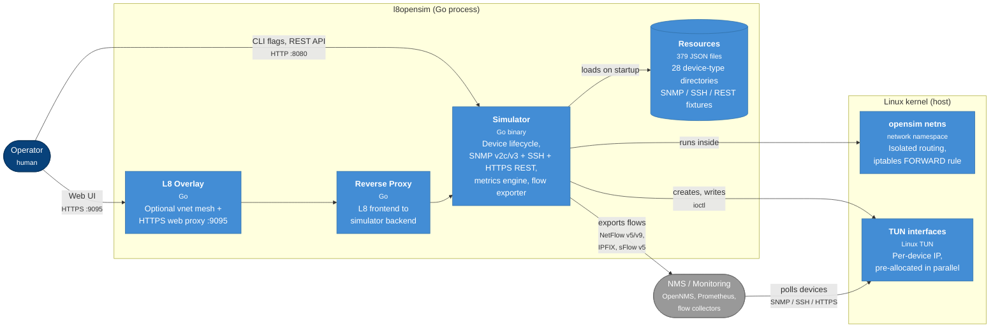

# Architecture

l8opensim is a single Go program that stands up thousands of simulated
devices inside a dedicated Linux network namespace. Each simulated device has
its own IP address on a TUN interface, its own SNMP listener, its own SSH
server, and — for storage devices — its own HTTPS REST endpoint.

This page covers the package layout, core components, and the key design
decisions that make the 30,000-device target tractable.

## System overview

The diagram below is laid out as a [C4 container](https://c4model.com/#ContainerDiagram)
view (rendered as a Mermaid flowchart): it shows what lives inside the
l8opensim process boundary, the host-side Linux infrastructure it depends on,
and how operators and monitoring systems interact with it.

## Package layout

| Path | Purpose |
|------|---------|
| `go/simulator/` | Core simulator — all device simulation logic and tests. |
| `go/simulator/resources/` | Per-device-type JSON resource files (SNMP / SSH / REST) across 28 device-type directories, plus the `worldcities/` datasets used for `sysLocation`. |

Top-level helper scripts: `diagnose_system.sh`, `ubuntu_setup.sh`,
`increase_file_limits.sh`. The [`Makefile`](https://github.com/labmonkeys-space/l8opensim/blob/main/Makefile)
is the canonical build entry point.

## Core simulator components (`go/simulator/`)

### Device lifecycle

`simulator.go` (CLI entry) → `manager.go` (`SimulatorManager`, shared keys /
certs) → `device.go` (per-device startup, protocol server lifecycle).

### SNMP stack

`snmp_server.go` → `snmp.go` (request handling) → `snmp_handlers.go` (OID
lookup via `sync.Map`) → `snmp_response.go` (response building) →
`snmp_encoding.go` (ASN.1 BER/DER). SNMPv3 is handled separately in
`snmpv3.go` + `snmpv3_crypto.go` (MD5 / SHA1 auth, DES / AES128 privacy).

### Metrics engine

`metrics_cycler.go` drives 100-point pre-generated sine-wave patterns per
device. `gpu_metrics.go` handles per-GPU metrics (utilization, VRAM,
temperature, power, clocks). `device_profiles.go` defines per-category
baselines.

### Network infrastructure

`tun.go` creates TUN interfaces, `netns.go` manages the `opensim` network
namespace, `prealloc.go` does parallel pre-allocation of TUN interfaces
(configurable worker count 100–200) for fast scaling. See
[Network namespace](../ops/network-namespace.md) for the namespace operator
guide.

### Web API

`web.go` (route setup) + `api.go` (handlers) + `web_routes*.go` (Linux route
script generation). Serves device CRUD, CSV export, system stats, and flow
export status (`GET /api/v1/flows/status`). See [Web API](web-api.md) for
the endpoint catalog.

### Flow export

`flow_exporter.go` (`FlowExporter`, `FlowEncoder` interface, `SimulatorManager`
integration) + `netflow5.go` / `netflow9.go` / `ipfix.go` / `sflow.go`.
One shared UDP socket and ticker goroutine; per-device `FlowExporter` owns
a `FlowCache`. See [Flow export reference](flow-export.md).

### Resource loading

`resources.go` loads and caches the 379 JSON files at startup. Each device
type directory has split JSON files for SNMP, SSH, and REST responses that
are merged at load time. See [Resource files](resource-files.md).

## Key design decisions

- **`sync.Map` for OID lookups** — lock-free O(1) access during concurrent
  SNMP queries.
- **Pre-computed next-OID mappings** — efficient SNMP `GETNEXT` / `WALK`
  without scanning the table.
- **Buffer pool** — reduces GC pressure on SNMP request handling.
- **Shared SSH / TLS keys** across all devices — avoids per-device key
  generation overhead.
- **Analytic HC counters** — `ifHCInOctets` / `ifHCOutOctets` computed on
  demand instead of maintained by a polling loop; see
  [SNMP reference](snmp.md#dynamic-hc-interface-traffic-counters).
- **Network namespace isolation** — the `opensim` namespace prevents
  systemd-networkd interference on many Linux distros.
- **Per-device flow egress** — a `FORWARD -i veth-sim-host -j ACCEPT`
  iptables rule lets per-device flow exporters send UDP out of the
  namespace through the host's routing table (Docker-present hosts default
  `FORWARD` to `DROP`). The rule is removed in `NetNamespace.Close`.

## Container image

The simulator is published as `ghcr.io/labmonkeys-space/l8opensim` on
push to `main` and on release tags — see the project's CI workflow
files.
